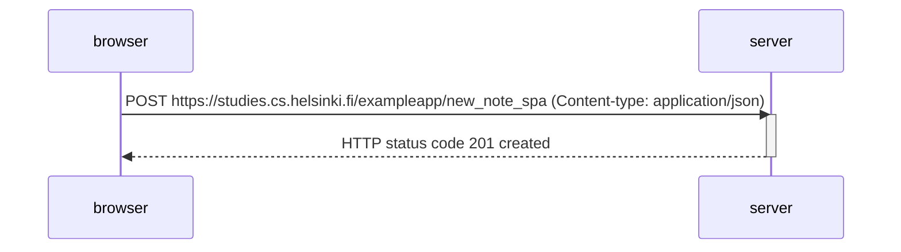

```mermaid
sequenceDiagram
    participant browser
    participant server
    
    browser->>server: POST https://studies.cs.helsinki.fi/exampleapp/new_note_spa (Content-type: application/json)
    activate server
    server-->>browser: HTTP status code 201 created
    deactivate server
```
